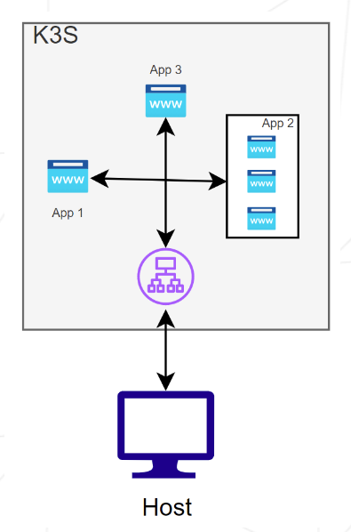

# Overview

The second part of the project requires us to deploy **3 web applications of our choice** on our **K3s instance**. The second app must have 3 replicas. Here, the K3s setup runs in **single-node cluster mode.** There is **no K3s agent node,** just **a single K3s server** acting as both the control plane and the agent.



To enable connectivity for our apps, we need:

- **An ingress controller:** K3s includes a built-in ingress controller (usually Traefik) that is installed automatically when you set up K3s using [https://get.k3s.io](https://get.k3s.io/).
- **Ingress rules configuration:** We create ingress resource definitions to route traffic.
- For each app, provide:
    - A `deployment.yaml` ****to define the pods.
    - A `service.yaml` ****to expose the pods within the cluster, allowing the ingress controller to route traffic to them.

For the deployment, we use the latest version of the container image created by Paul Bouwer called hello-kubernetes. This image prints a simple "Hello World". We modify it to instead display “Hello from app X”. For more details, see the original image on Docker Hub: https://hub.docker.com/r/paulbouwer/hello-kubernetes

## **Table of Contents**

- [Usage](#usage)
- [Overview](#overview)
- [Vagrantfile explanation](#vagrantfile)
- [Ingress](#ingress)
- [Resources](#resources)

# Usage

To **launch the virtual machine** using **Vagrant**, run : 

```bash
cd p2

# Start the Vagrant environment
vagrant up
```

**You can then SSH into the VM :** 

```bash
# Access the Kubernetes server VM
vagrant ssh lduheronS
```


## Vagrantfile

This Vagrantfile declares a **single-node K3s cluster**. It uses the same setup options as the `p1/Vagrantfile`, described in `p1/README.md`.

## Ingress

Ingress is an API object that manages external access to the services in a cluster, typically HTTP.

# Resources

- **Kubernetes - Cluster networking :** https://kubernetes.io/docs/concepts/cluster-administration/networking/
- **Kubernetes - Ingress documentation :** https://kubernetes.io/docs/concepts/services-networking/ingress/
- **Kubernetes - Services, load balancing and networking :** https://kubernetes.io/docs/concepts/services-networking/
- **K3s cluster using vagrant :** https://medium.com/@dharsannanantharaman/create-a-high-availabilty-lightweight-kubernetes-k3s-cluster-using-vagrant-822a1e025855