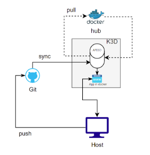

# Overview

The final mandatory part of the project focuses on deploying an application based on `wil42/playground` using **Docker with K3d, Argo CD, continuous integration and GitOps.** Unlike the previous parts, this one does not rely on Vagrant.



## Table of Contents

- [Overview](#overview)
- [Usage](#usage)
- [Continuous Integration (CI)](#continuous-integration-ci)
- [Continuous developpement using Argo CD](#continuous-deployment-cd-with-argo-cd)
- [About K3d](#about-k3d)
- [Scripts](#scripts)
  - [argocd_init.sh](#argocd_init.sh)
  - [setup_k3d_cluster.sh](#setup_k3d_cluster.sh)
  - [reset_k3d_env.sh](#reset_k3d_env.sh)
  - [argocd-app.yaml](#argocd-app.yaml)
- [Resources](#resources)

# Usage

First, the project requires a few **prerequisites** to be installed on the host machine : Docker, K3d, Kubernetes and Argo CD. This dependencies can be set up by running `set_upk3d_cluster.sh` script : 

```bash
# Set up the environment
bash setup_k3d_cluster.sh
```

Then, run the Argo CD initialization script : 

```bash
bash argocd_init.sh
```

Once Argo CD is running, access the web interface and generate a password :

- open :  [https://localhost:8082](https://localhost:8082/)
- **Username** : `admin`
- **Password** : *retrieve it with :*

```bash
kubectl -n argocd get secret argocd-initial-admin-secret -o jsonpath="{.data.password}" | base64 -d
```

To access the deployed application, forward the service port:

```bash
kubectl port-forward svc/ftegan-app -n dev 8088:80
```

Finally, open [http://localhost:8088](http://localhost:8088/) or :

```bash
curl http://localhost:8088/
```

### Testing continuous integration

In order to **test continuous integration**, push a new version (v2) on GitHub repository :
https://github.com/NGdev2/ftegan

Update the image from `wil42/playground:v1` to `wil42/playground:v2`

Then monitor the Kubernetes resources as Argo CD automatically redeploys the application :

```bash
# Run this with short delays (1–3 seconds) to observe changes
kubectl get all -n dev
```

Watch for updated replicas, deployments, and pods.

### Clean

To **clean** everything up and **reset the environment :**

```bash
./cleanup.sh
```

This will:
- Stop port-forwards
- Delete the K3d cluster
- Remove dangling containers

## Continuous Integration (CI)

**Continuous Integration (CI)** is a development practice where code changes from multiple developers are automatically built, tested, and validated each time they are committed to a shared repository. The main objective is to detect errors early and ensure that the code base remains stable and reduce integration problems. Instead of waiting until the end of a development cycle to merge features, which often leads to conflicts and lots of debugging, CI encourages small and regular updates that are automatically verified. This fosters a faster development pace, better collaboration and higher software quality.

## Continuous Deployment (CD) with Argo CD

## About K3d

# Scripts

## setup_k3d_cluster.sh

This script installs the few environment requirements of the project : Docker, K3d, kubectl from Kubernetes and Argo CD.  As required by the subject, creates two namespaces :

```bash
echo -e "${GREEN}Creating namespaces...${RESET}"
kubectl create namespace argocd --dry-run=client -o yaml | kubectl apply -f -
kubectl create namespace dev --dry-run=client -o yaml | kubectl apply -f -
```

## argocd_init.sh

## reset_k3d_env.sh

## argocd-app.yaml

# Resources

- **ArgoCD - Read the docs :** https://argo-cd.readthedocs.io/en/stable/
- **What is CI/CD - RedHat :** https://www.redhat.com/en/topics/devops/what-is-ci-cd
- **GitOps - Redhat :** https://www.redhat.com/fr/topics/devops/what-is-gitops
